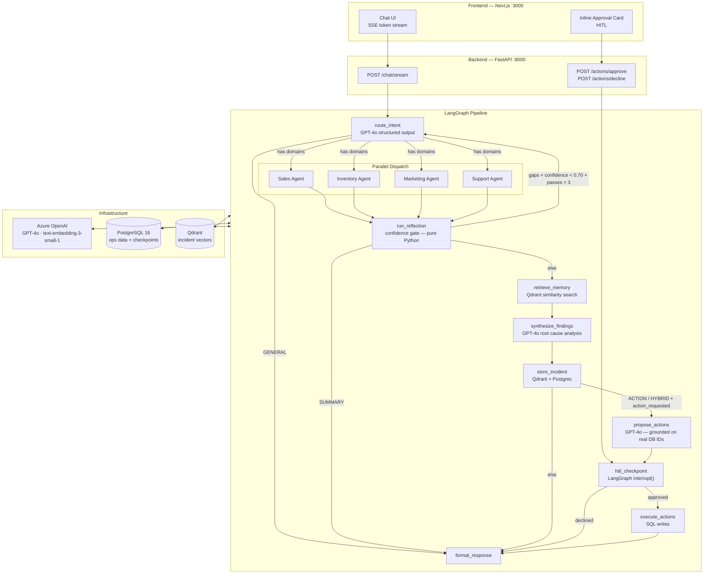

# Ecomm Ops Brain

An AI operations manager for e-commerce — powered by a multi-agent LangGraph pipeline with human-in-the-loop action approval.

Ask it a question like *"Why did sales drop yesterday?"* and it dispatches specialist agents across Sales, Inventory, Marketing, and Support in parallel, scores its own confidence, synthesises a root cause analysis, recalls similar past incidents, and — if you ask — proposes and executes corrective actions after your approval.

---

## Architecture



---

## Tech Stack

| Layer | Technology |
|---|---|
| Frontend | Next.js 15 App Router, Tailwind CSS, Zustand, SSE |
| Backend API | FastAPI ≥ 0.115, Python 3.12 |
| Orchestration | LangGraph ≥ 1.0, AsyncPostgresSaver checkpointer |
| LLM / Embeddings | Azure OpenAI GPT-4o, text-embedding-3-small-1 (1536-dim) |
| Agent Framework | LangChain ≥ 1.0 |
| Vector Store | Qdrant v1.9.2 — cosine similarity, score_threshold = 0.5 |
| Relational DB | PostgreSQL 16, SQLAlchemy asyncio, asyncpg |
| Observability | Langfuse (LangChain callbacks, opt-in) |
| Evaluation | DeepEval |

---

## Quick Start

```bash
# 1. Copy and fill in environment variables
cp .env.example .env
# Required: AZURE_OPENAI_API_KEY and AZURE_OPENAI_ENDPOINT

# 2. Start all services
docker compose up --build -d

# 3. Open the UI
open http://localhost:3000
```

> **Local development (without Docker):** start Postgres and Qdrant separately, then run `uvicorn app.main:app --reload` from `backend/` and `pnpm dev` from `frontend/`.

---

## Environment Variables

| Variable | Default | Required |
|---|---|---|
| `AZURE_OPENAI_API_KEY` | — | Yes |
| `AZURE_OPENAI_ENDPOINT` | — | Yes |
| `AZURE_OPENAI_DEPLOYMENT` | `gpt-4o` | No |
| `AZURE_OPENAI_API_VERSION` | `2024-10-21` | No |
| `AZURE_OPENAI_EMBEDDING_DEPLOYMENT` | `text-embedding-3-small-1` | No |
| `POSTGRES_URL` | `postgresql+asyncpg://...@localhost:5432/ecomm_ops` | No |
| `QDRANT_URL` | `http://localhost:6333` | No |
| `QDRANT_COLLECTION` | `incidents` | No |
| `LANGFUSE_PUBLIC_KEY` | `""` (disabled) | No |
| `FRONTEND_URL` | `http://localhost:3000` | No |

See `.env.example` for the full list.

---

## API Endpoints

| Method | Path | Description |
|---|---|---|
| `GET` | `/health` | Liveness check |
| `GET` | `/ready` | Readiness — verifies Postgres + Qdrant |
| `POST` | `/chat/stream` | SSE streaming chat |
| `POST` | `/actions/approve` | Resume graph — apply approved actions |
| `POST` | `/actions/decline` | Resume graph — discard proposed actions |
| `GET` | `/incidents` | List stored incident history |
| `GET` | `/incidents/{id}` | Single incident detail |

---

## Demo Scenarios

**Diagnostic — "Why did sales drop yesterday?"**
Dispatches all four specialist agents in parallel → reflection scores confidence → root cause analysis synthesised → similar past incidents surfaced.

**Action — "Fix the problem."**
Action agent proposes concrete corrective steps (restock, pause/resume campaign, create ticket) grounded on real database IDs → HITL approval card appears → graph suspends via `interrupt()` → approved actions execute as SQL writes.

**Memory — "What did we do last time this happened?"**
Current incident is embedded → Qdrant semantic search returns top-3 similar past incidents with their root causes and actions taken.

---

## Project Structure

```
ecomm-ops-brain/
├── backend/
│   ├── app/
│   │   ├── agents/          # intent_router, sales/inventory/marketing/support agents,
│   │   │                    # reflection_agent, action_agent
│   │   ├── graph/           # state.py (OpsState), nodes.py, edges.py, workflow.py
│   │   ├── tools/           # LangChain tools per domain + action_tools.py
│   │   ├── memory/          # episodic.py (Qdrant store/retrieve)
│   │   ├── repositories/    # interfaces + postgres/ implementations
│   │   ├── api/routes/      # chat, actions, incidents, health
│   │   ├── db/              # postgres.py, qdrant.py, checkpointer.py
│   │   └── core/            # config.py, llm.py, observability.py, exceptions.py
│   ├── tests/
│   │   ├── unit/            # state, graph, tools, models, observability
│   │   ├── integration/     # end-to-end graph runs
│   │   └── eval/            # DeepEval agent evaluation
│   ├── Dockerfile
│   └── pyproject.toml
├── frontend/
│   ├── src/
│   │   ├── app/             # Next.js App Router + /api proxy routes
│   │   ├── components/      # Chat UI, ApprovalCard, Sidebar, InputBar
│   │   ├── hooks/           # useChat (SSE streaming)
│   │   └── lib/             # Zustand store, API client
│   ├── Dockerfile
│   └── package.json
├── docker-compose.yml
├── docker-compose.dev.yml
└── .env.example
```

---

## Documentation

| Doc | Contents |
|---|---|
| [`docs/architecture.md`](docs/architecture.md) | System context, component, and Docker Compose diagrams |
| [`docs/internals.md`](docs/internals.md) | Deep-dive Mermaid diagrams — every node, edge, and data flow |
| [`docs/sequence.md`](docs/sequence.md) | Sequence diagrams for all 5 query types |
| [`docs/lld.md`](docs/lld.md) | Low-level design — API contracts, DB schema, tool signatures |
| [`docs/hld.md`](docs/hld.md) | High-level design — goals, constraints, component responsibilities |
| [`docs/database.md`](docs/database.md) | Full database schema |
| [`docs/MASTER.md`](docs/MASTER.md) | Comprehensive reference — LangGraph internals, design decisions |

---

## Running Tests

```bash
cd backend

# Unit tests — no LLM calls, no external services
python -m pytest tests/unit/ -v

# Integration tests — requires running Postgres + Qdrant
python -m pytest tests/integration/ -v

# DeepEval agent evaluation — requires Azure OpenAI
python -m pytest tests/eval/ -v -m eval --tb=short
```
