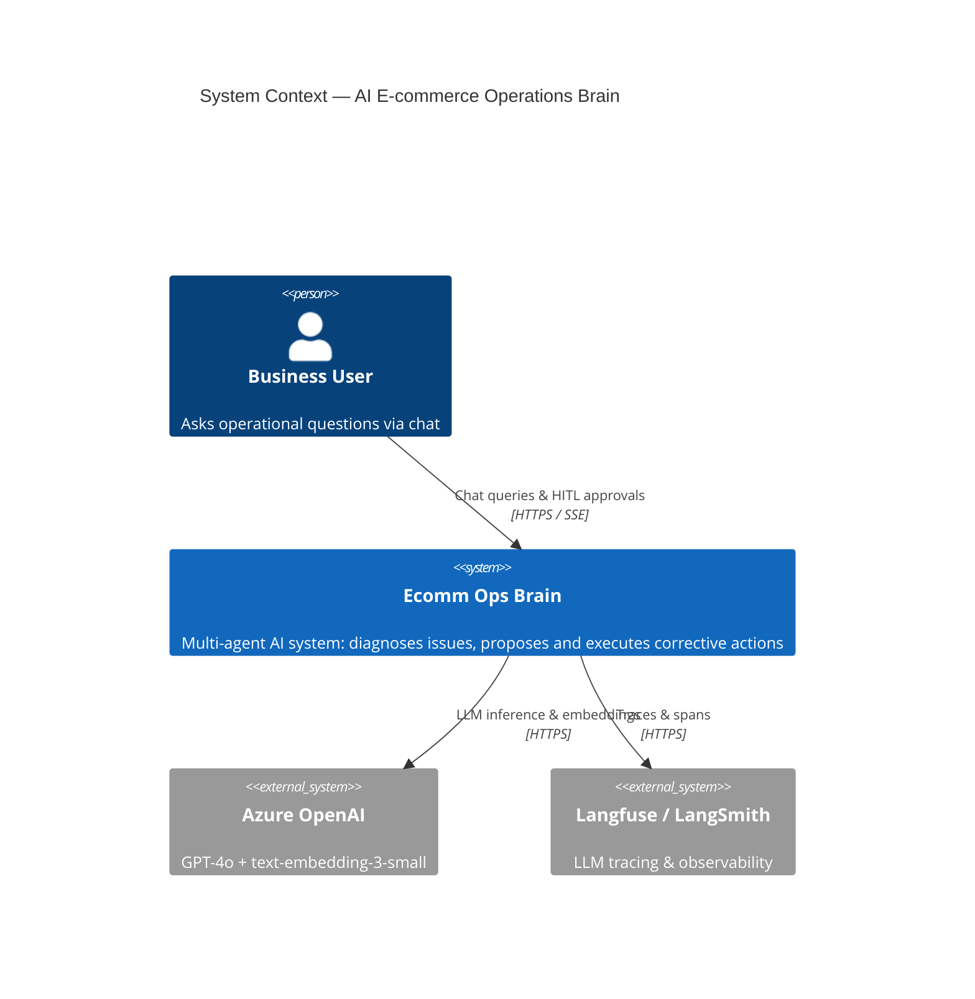
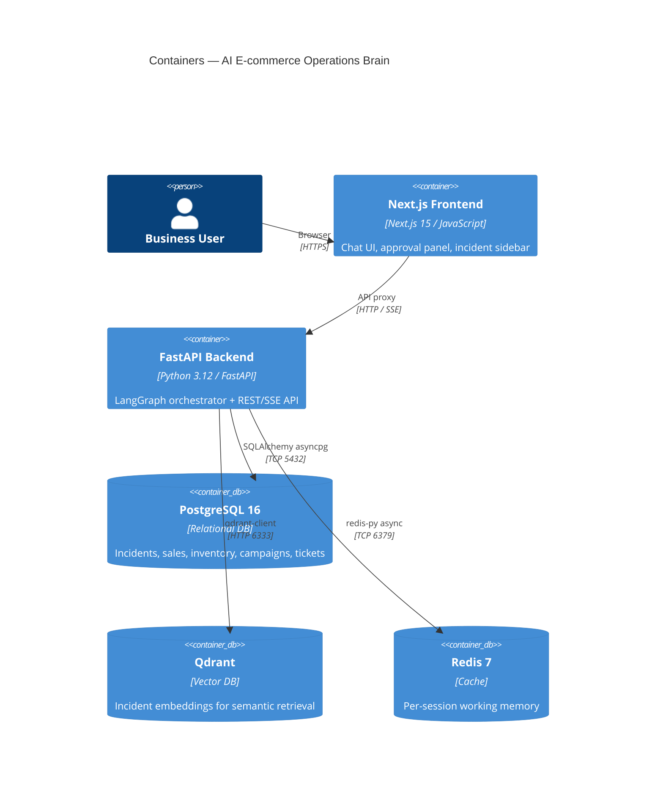

# AI E-commerce Operations Brain — Docs

| Doc | What's inside |
|---|---|
| [architecture.md](architecture.md) | Container diagram, component diagram, tech stack |
| [agent-design.md](agent-design.md) | LangGraph workflow, agent tools, reflection logic |
| [api-reference.md](api-reference.md) | Endpoint sequence diagrams |
| [data-model.md](data-model.md) | ER diagram, Pydantic class diagrams |
| [frontend.md](frontend.md) | Component tree, state diagram, SSE flow |
| [development.md](development.md) | Setup steps, test commands |
| [deployment.md](deployment.md) | Docker Compose service graph, startup sequence |

## System Context

## Container Diagram

