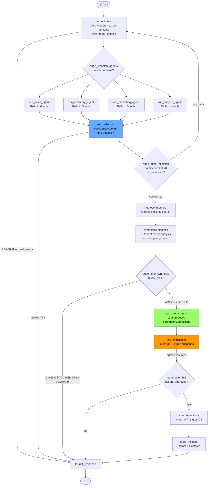
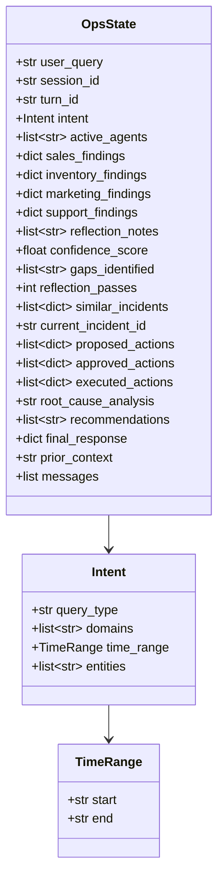
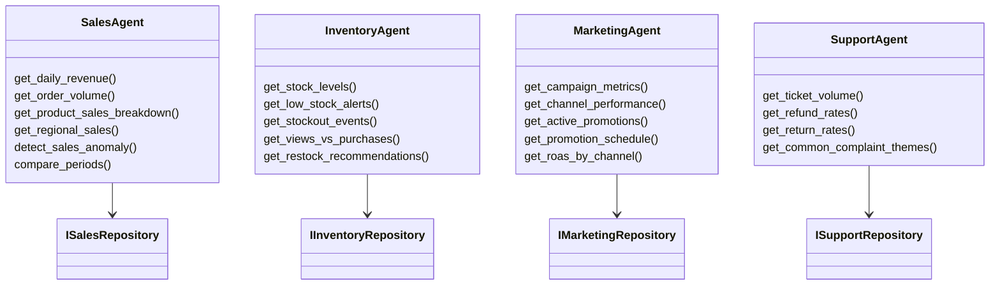
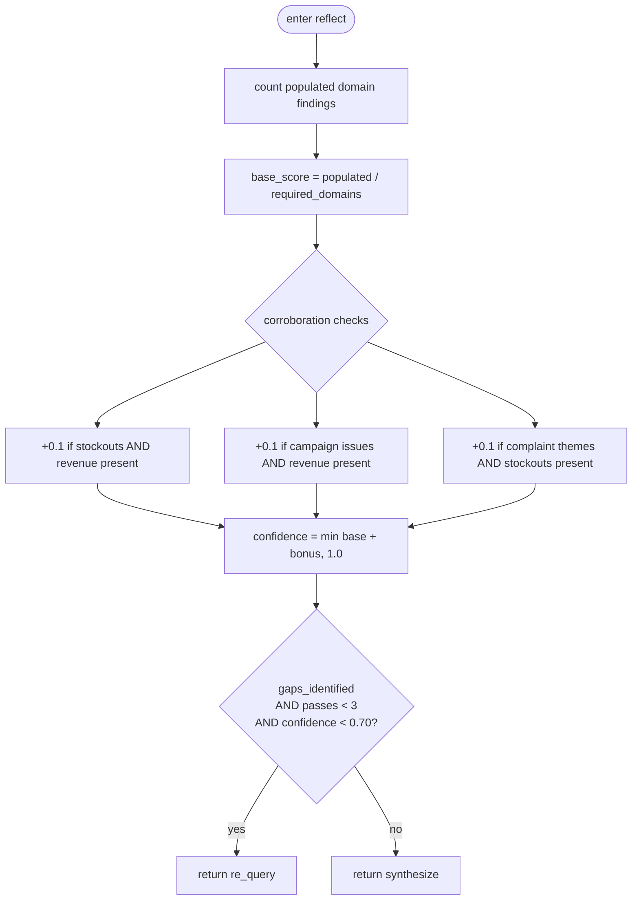
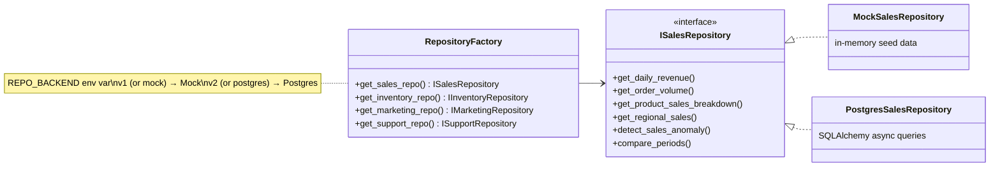
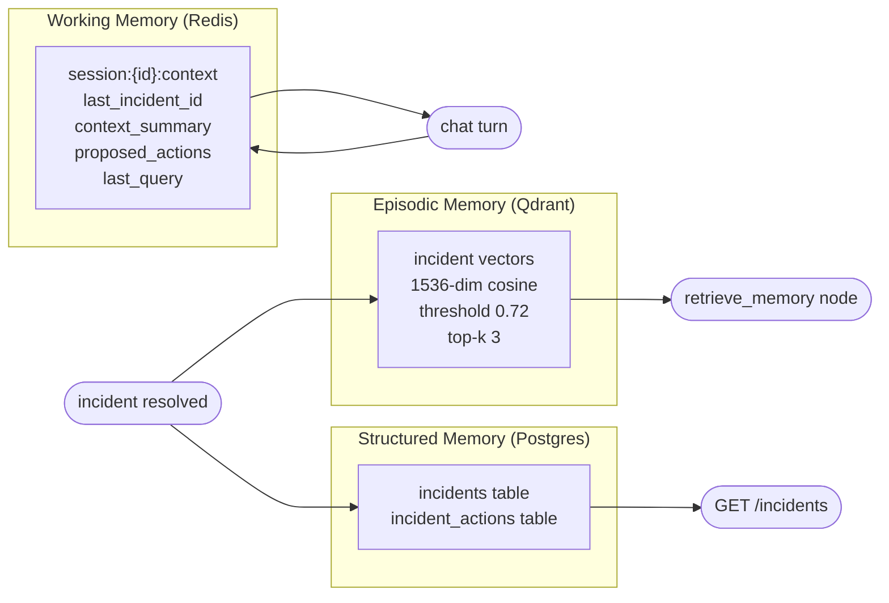

# Agent Design

## LangGraph Workflow



---

## OpsState Schema



---

## Agent Tools



---

## Reflection Agent Logic



---

## Repository Pattern



---

## Memory Architecture




All nodes read from and write to a single `OpsState` TypedDict. The LangGraph checkpointer persists this per thread.

```python
class OpsState(TypedDict):
    # Input
    user_query: str
    session_id: str
    turn_id: str

    # Routing
    intent: Optional[Intent]       # query_type, domains, time_range, entities
    active_agents: list[str]       # domain names dispatched this turn

    # Agent findings
    sales_findings: Optional[dict]
    inventory_findings: Optional[dict]
    marketing_findings: Optional[dict]
    support_findings: Optional[dict]

    # Reflection
    reflection_notes: list[str]
    confidence_score: float        # 0.0 – 1.0
    gaps_identified: list[str]     # e.g. ["missing_inventory_data"]
    reflection_passes: int

    # Memory
    similar_incidents: list[dict]
    current_incident_id: Optional[str]

    # Actions
    proposed_actions: list[dict]   # ProposedAction dicts
    approved_actions: list[dict]
    executed_actions: list[dict]

    # Response
    root_cause_analysis: Optional[str]
    recommendations: list[str]
    final_response: Optional[dict]

    # Conversation
    messages: Annotated[list, add_messages]
```

### Intent schema

```python
class Intent(TypedDict):
    query_type: str       # DIAGNOSTIC | ACTION | MEMORY | SUMMARY | HYBRID | GENERAL
    domains: list[str]    # subset of [sales, inventory, marketing, support]
    time_range: TimeRange # { start: "YYYY-MM-DD", end: "YYYY-MM-DD" }
    entities: list[str]   # product names, campaign IDs, SKUs
```

