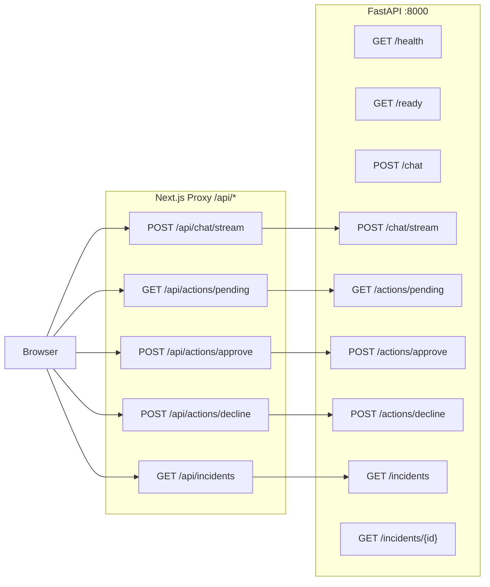
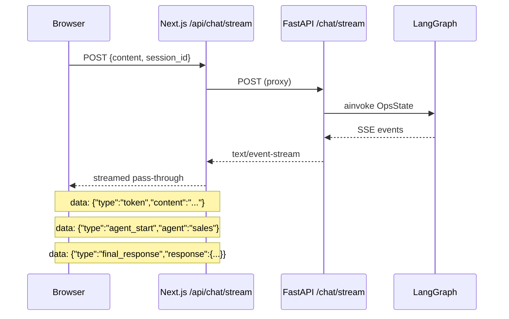
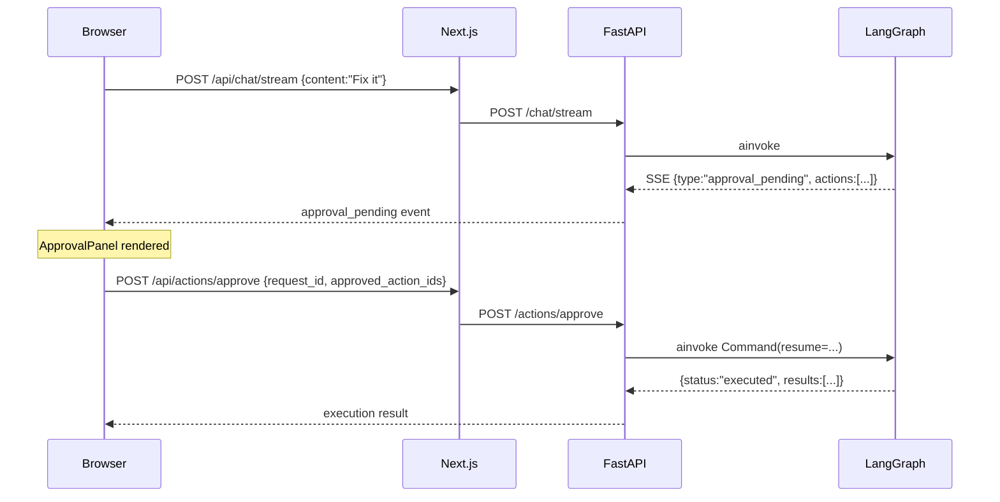
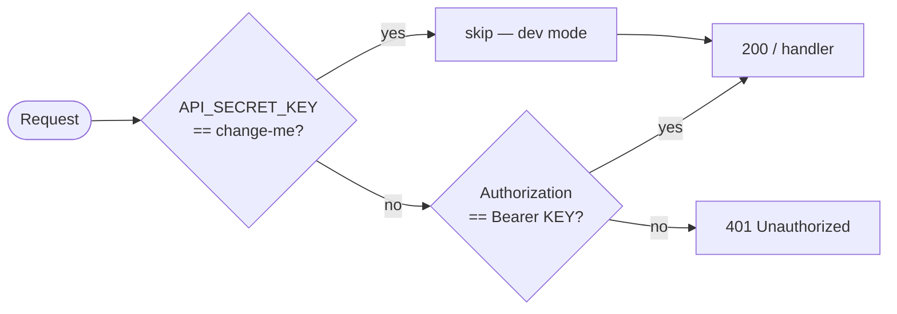
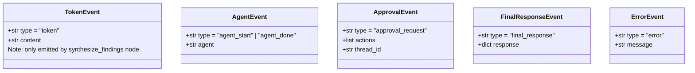

# API Reference

## Endpoint Map

---

## Diagnostic Query Flow (SSE)

---

## HITL Action Flow

---

## Endpoints

### Health

| Method | Path | Auth | Response |
|---|---|---|---|
| GET | `/health` | No | `{"status":"ok"}` |
| GET | `/ready` | No | `{"status":"ready"\|"degraded","checks":{postgres,redis,qdrant}}` |

### Chat

| Method | Path | Auth | Body | Response |
|---|---|---|---|---|
| POST | `/chat` | Bearer | `{content, session_id?}` | `{session_id, turn_id, response}` |
| POST | `/chat/stream` | Bearer | `{content, session_id?}` | SSE stream |

### Actions

| Method | Path | Auth | Body | Response |
|---|---|---|---|---|
| POST | `/actions/approve` | Bearer | `{request_id, approved_action_ids}` | `{status:"executed", results}` |
| POST | `/actions/decline` | Bearer | `{request_id}` | `{status:"declined"}` |

### Incidents

| Method | Path | Auth | Response |
|---|---|---|---|
| GET | `/incidents` | Bearer | `{incidents:[IncidentSummary]}` max 20 |
| GET | `/incidents/{id}` | Bearer | `{incident:{...actions:[]}}` or 404 |

---

## Auth Flow

---

## SSE Event Types

