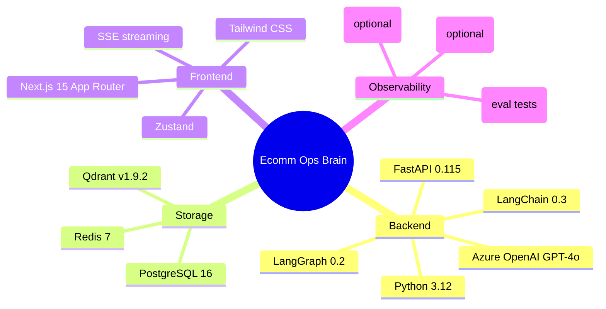
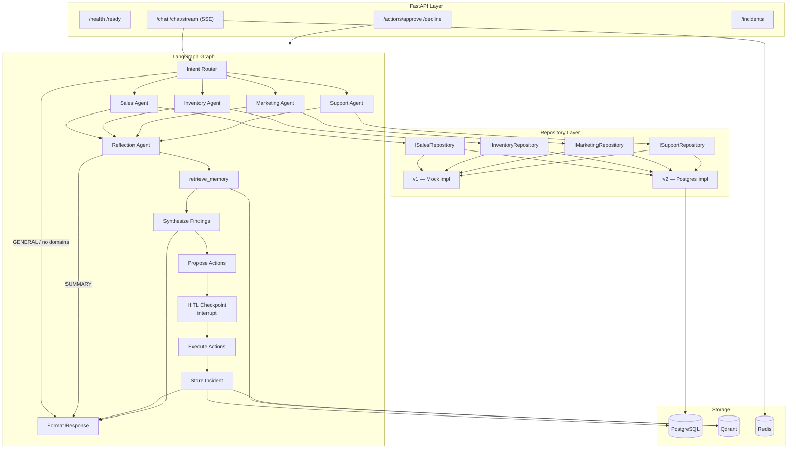
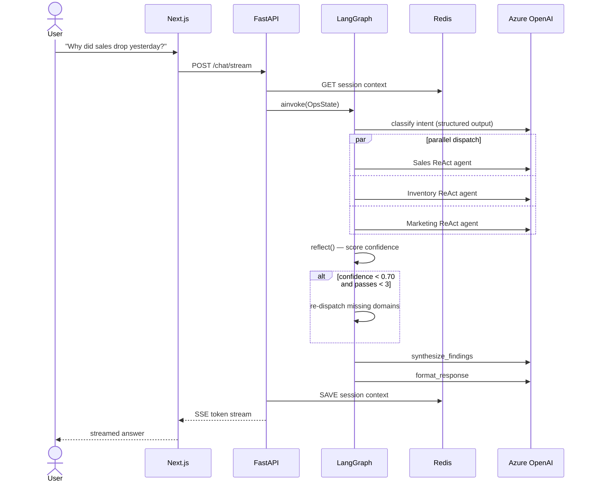
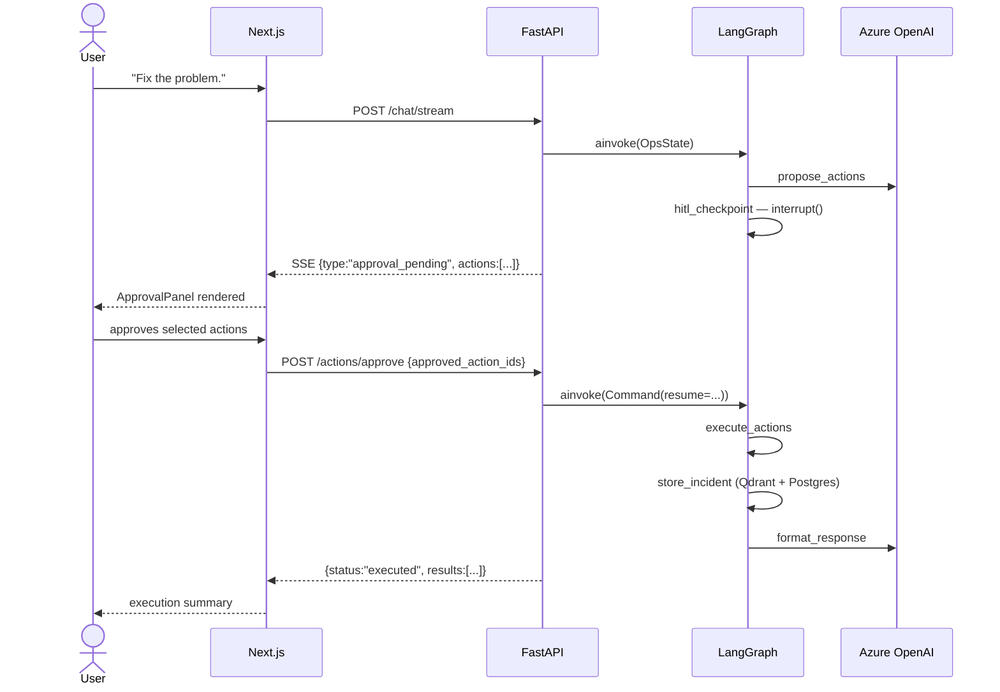
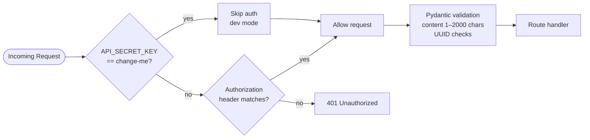
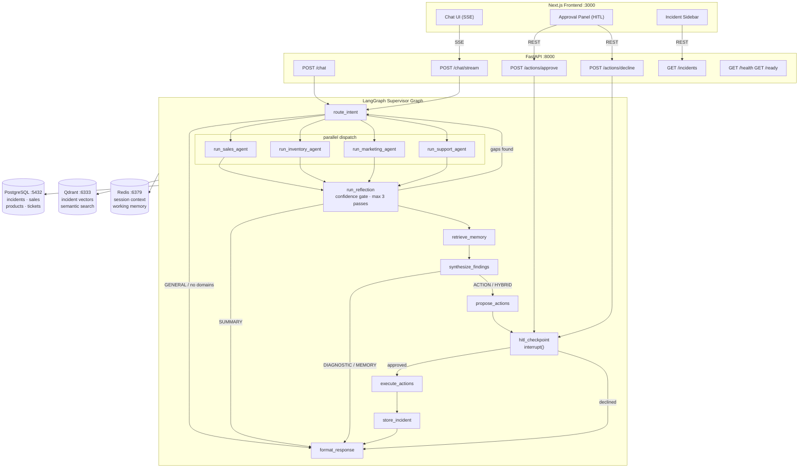

# Architecture

## Tech Stack

---

## Backend Component Diagram

---

## Request Lifecycle — Diagnostic Query

---

## Request Lifecycle — Action / HITL Query

---

## Security Model

---

## 1. System Overview

The AI E-commerce Operations Brain is a multi-agent system that acts as a smart operations manager for an online store. It:

- Answers high-level business questions by cross-domain investigation
- Identifies root causes by correlating signals from Sales, Inventory, Marketing, and Support
- Proposes corrective actions and executes them only after human approval (HITL)
- Recalls similar past incidents using semantic long-term memory

### Core Scenarios

| Scenario | Example Query | Behavior |
|---|---|---|
| Diagnostic | "Why did sales drop yesterday?" | Parallel agent investigation → root cause report |
| Action | "Fix the problem." | Propose actions → HITL approval gate → execute |
| Memory | "What did we do last time?" | Qdrant semantic search → surface past decisions |
| Summary | "Summarize yesterday's health." | Structured executive summary |

---

## 2. Tech Stack

### Backend

| Layer | Technology | Version |
|---|---|---|
| API Gateway | FastAPI | ≥ 0.115 |
| Orchestration | LangGraph | ≥ 0.2 |
| LLM | Azure OpenAI GPT-4o | API version 2024-10-21 |
| Agent Framework | LangChain | ≥ 0.3 |
| Vector Memory | Qdrant | v1.9.2 |
| Structured DB | PostgreSQL + asyncpg + SQLAlchemy | PG 16, SA ≥ 2.0 |
| Session Cache | Redis | 7-alpine |
| Observability | Langfuse + LangSmith | optional |
| LLM Evaluation | DeepEval | ≥ 0.21 |
| Runtime | Python | 3.12 |

### Frontend

| Layer | Technology |
|---|---|
| Framework | Next.js 15 (App Router) |
| Language | JavaScript (ES modules) |
| Styling | Tailwind CSS |
| State | Zustand |
| Real-time | Server-Sent Events (SSE via fetch streaming) |

### Infrastructure

| Component | Technology |
|---|---|
| Containerization | Docker Compose |
| Reverse Proxy | Nginx (production intent; not configured in current Compose) |

---

## 3. High-Level Architecture

---

## 4. Request Lifecycle

### Diagnostic query (POST /chat or POST /chat/stream)

1. Frontend sends `{ content, session_id }` to the Next.js API proxy.
2. Proxy forwards to `POST /chat/stream` on FastAPI.
3. FastAPI builds `OpsState`, restores session context from Redis.
4. LangGraph executes the compiled graph:
   - `route_intent` → LLM classifies query type, domains, time range.
   - Parallel dispatch to relevant specialist agents.
   - Each agent (ReAct loop) calls domain tools → populates `*_findings`.
   - `run_reflection` scores confidence; if < 0.70 and passes < 3, re-routes to missing domains.
   - `retrieve_memory` → Qdrant similarity search for past incidents.
   - `synthesize_findings` → LLM root cause analysis.
   - `format_response` → structured final response.
5. FastAPI streams SSE tokens back to the frontend.
6. Session context (incident ID, proposed actions, last query) is saved to Redis.

### Action query

Same as above through `synthesize_findings`, then:

1. `propose_actions` → LLM generates parameterized `ProposedAction` list.
2. `hitl_checkpoint` calls `interrupt()` — graph suspends and returns `approval_pending` response.
3. Frontend renders `ApprovalPanel`; user approves or declines.
4. Frontend calls `POST /actions/approve` or `POST /actions/decline` with `request_id`.
5. FastAPI resumes the graph via `Command(resume=...)`.
6. `execute_actions` runs approved tools → `store_incident` persists to Qdrant + Postgres.
7. `format_response` returns execution summary.

---

## 5. LangGraph Workflow

### Graph nodes

| Node | Responsibility |
|---|---|
| `route_intent` | Parse query; set `intent` and `active_agents` |
| `run_sales_agent` | ReAct agent with 6 sales tools |
| `run_inventory_agent` | ReAct agent with 5 inventory tools |
| `run_marketing_agent` | ReAct agent with 5 marketing tools |
| `run_support_agent` | ReAct agent with 4 support tools |
| `run_reflection` | Score confidence; identify data gaps |
| `retrieve_memory` | Qdrant similarity search for past incidents |
| `synthesize_findings` | LLM root cause synthesis |
| `propose_actions` | LLM proposes parameterized corrective actions |
| `hitl_checkpoint` | `interrupt()` — suspends graph for human decision |
| `execute_actions` | Run approved action tools |
| `store_incident` | Persist incident to Qdrant + Postgres |
| `format_response` | Build final structured response dict |

### Conditional edges

| Source | Condition | Targets |
|---|---|---|
| `route_intent` | `edge_dispatch_agents` | parallel → all relevant agent nodes |
| `run_reflection` | `edge_after_reflection` | `re_query` → `route_intent` OR `synthesize` → `retrieve_memory` |
| `synthesize_findings` | `edge_after_synthesis` | `propose_actions` (ACTION/HYBRID) OR `format_response` |
| `hitl_checkpoint` | `edge_after_hitl` | `execute_actions` (approved) OR `format_response` |
| `execute_actions` | `edge_after_execution` | always → `store_incident` |

### Re-query guard

`MAX_REFLECTION_PASSES = 3`. On re-query, only the domains still listed in `gaps_identified` are re-dispatched; findings from other domains are preserved in state.

### Checkpointing

On startup the graph tries to connect a `PostgresSaver` checkpointer (psycopg3). If Postgres is unavailable, it falls back to LangGraph's in-memory `MemorySaver`. Thread IDs are `{session_id}:{turn_id}`.

---

## 6. Data Layer

### Repository pattern

All domain data access goes through typed Protocol interfaces (`ISalesRepository`, `IInventoryRepository`, `IMarketingRepository`, `ISupportRepository`) defined in `repositories/interfaces.py`.

The active implementation is chosen by the `REPO_BACKEND` env var:

| Value | Implementation |
|---|---|
| `mock` (default) | In-memory mock data from `repositories/mock/` |
| `postgres` | SQLAlchemy queries in `repositories/postgres/` |

### PostgreSQL schema

See [data-model.md](data-model.md) for the full table definitions.

Key tables: `incidents`, `incident_actions`, `daily_sales`, `products`, `inventory`, `campaigns`, `support_tickets`.

### Qdrant collection

Collection name: `incidents` (configurable via `QDRANT_COLLECTION`).  
Vector model: Azure OpenAI `text-embedding-3-small` (1536 dimensions).  
Similarity threshold for retrieval: `0.72`.

---

## 7. Memory Architecture

Three memory tiers are implemented:

| Tier | Storage | Module | Purpose |
|---|---|---|---|
| Working | Redis | `memory/working.py` | Cross-turn context per session (last incident, proposed actions) |
| Episodic | Qdrant + Postgres | `memory/episodic.py` | Semantic retrieval of past incidents |
| Structured | Postgres | `memory/structured.py` | Queryable incident history, action log |

Incident embeddings are created from a text summary of the query, root cause, domains, and actions. Stored as `PointStruct` in Qdrant; mirrored as row in `incidents` table.

---

## 8. Human-in-the-Loop (HITL)

HITL is implemented using LangGraph's `interrupt()` primitive:

1. `hitl_checkpoint` node calls `interrupt({"proposed_actions": [...], "thread_id": ...})`.
2. The graph is suspended; the endpoint returns `{ type: "approval_pending", ... }`.
3. The frontend renders an inline `InlineApprovalCard` with action checkboxes.
4. `POST /actions/approve` (or `/decline`) resumes the graph via `Command(resume=...)`.
5. Approved action IDs are passed back into state; the executor filters to those IDs only.

---

## 9. Observability

| Tool | Integration | Config |
|---|---|---|
| Langfuse | LangChain callbacks on every node/agent call | `LANGFUSE_PUBLIC_KEY`, `LANGFUSE_SECRET_KEY`, `LANGFUSE_HOST` |
| LangSmith | `LANGCHAIN_TRACING_V2=true` env var | `LANGCHAIN_API_KEY` |
| DeepEval | `tests/eval/` test suite | Requires real Azure OpenAI calls — marked `@pytest.mark.eval` |

Langfuse is flushed on application shutdown via the FastAPI `lifespan` hook. If no Langfuse key is configured, tracing is silently disabled.

---

## 10. Security

- **Authentication**: Bearer token check on all routes via `verify_token` dependency. Token is `API_SECRET_KEY`. Enforcement is skipped when the key is `"change-me"` (dev default).
- **CORS**: Allowed origins are `FRONTEND_URL` and `http://localhost:3000`.
- **Secrets**: All secrets via environment variables (`.env` file, never committed).
- **Input validation**: All request bodies validated by Pydantic models (`ChatRequest` limits `content` to 2000 chars; UUIDs validated on `ApprovalRequest`).
- **SQL injection**: SQLAlchemy ORM with parameterized queries throughout.

---

## 11. Key Design Decisions

| Decision | Rationale |
|---|---|
| LangGraph over custom orchestration | Stateful graph with built-in checkpointing, cycle detection, and `interrupt()` for HITL |
| `interrupt()` for HITL | Lower operational complexity; no external workflow engine required |
| Mock + Postgres repository swap | Enables full local dev without a seeded database; `REPO_BACKEND=v1` (mock) or `v2` (postgres) |
| Azure OpenAI (not OpenAI directly) | Enterprise compliance; same API surface |
| PostgresSaver with MemorySaver fallback | Graph runs in dev even when Postgres is down |
| SSE over WebSocket for streaming | Simpler client implementation; unidirectional push is sufficient for token streaming |
