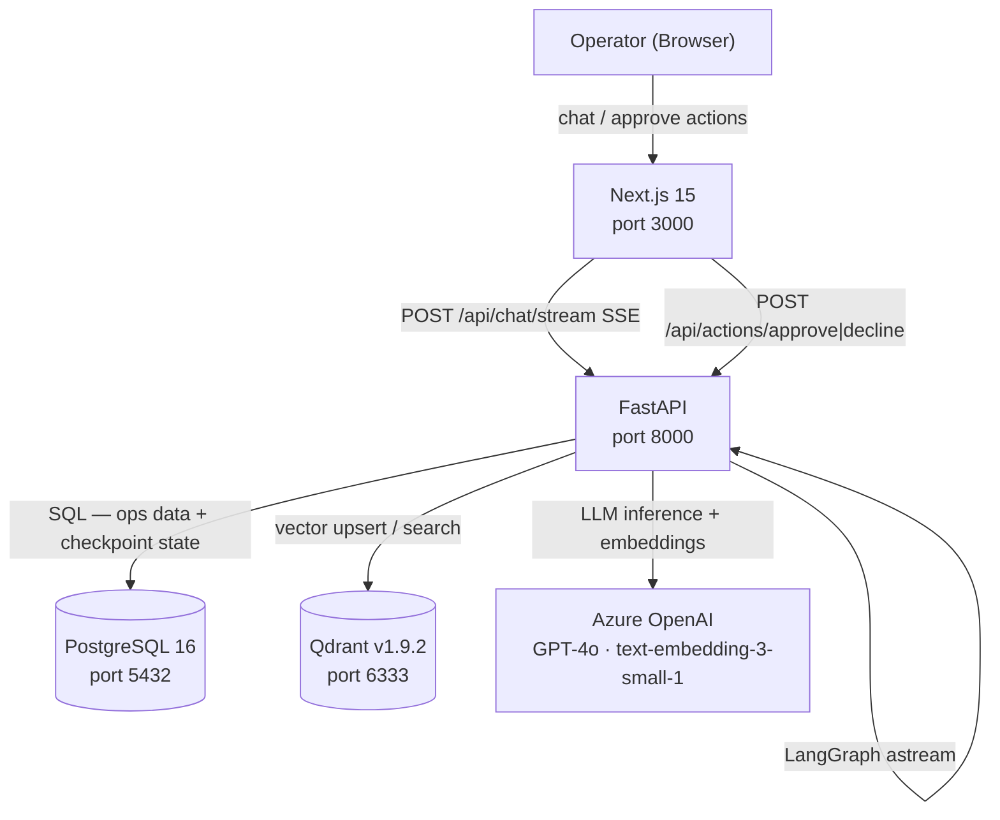
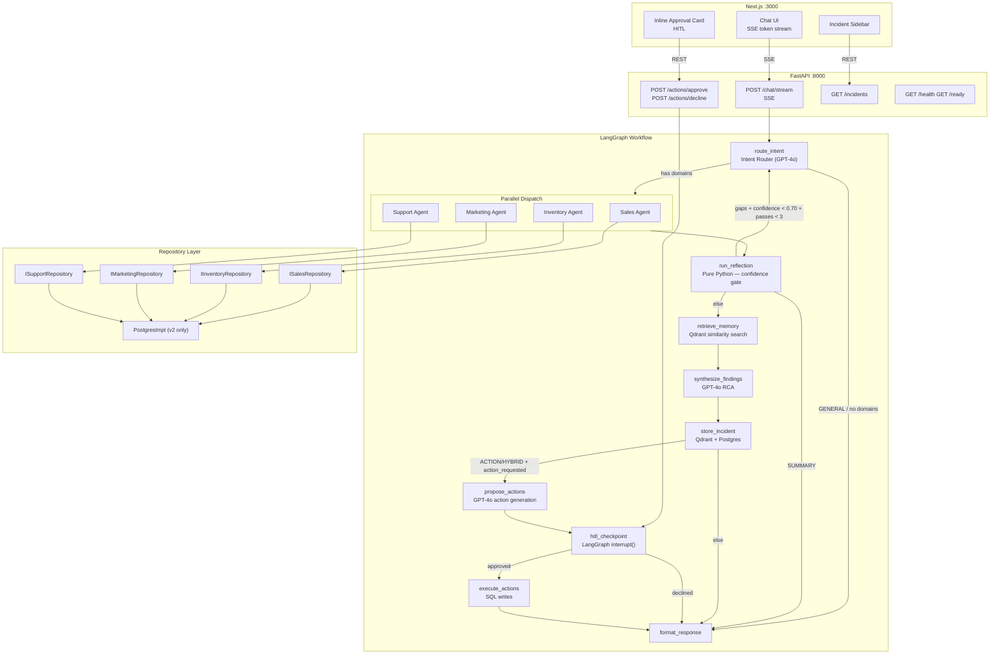
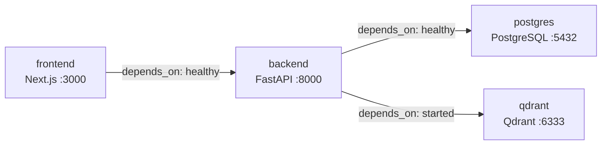

# Architecture — Ecomm Ops Brain

## System Context

All browser traffic routes through the Next.js proxy at `/api/*`. The browser never contacts the FastAPI backend directly.

---

## Component Diagram

---

## Docker Compose Services

Startup is enforced via `depends_on` health conditions. Migrations run automatically from `backend/app/db/migrations/` at backend startup.

---

## Tech Stack

| Layer | Technology |
|---|---|
| Frontend | Next.js 15 App Router, Tailwind CSS, Zustand, SSE |
| Backend API | FastAPI 0.115, Python 3.12 |
| Orchestration | LangGraph 0.2, AsyncPostgresSaver checkpointer |
| LLM / Embeddings | Azure OpenAI GPT-4o, text-embedding-3-small-1 (1536-dim) |
| Agent Framework | LangChain 1.0, create_agent (v1 API) |
| Vector Store | Qdrant v1.9.2 — cosine similarity, score_threshold=0.5 |
| Relational DB | PostgreSQL 16, SQLAlchemy asyncio, asyncpg |
| Observability | Langfuse (LangChain callbacks) |
| Evaluation | DeepEval |
