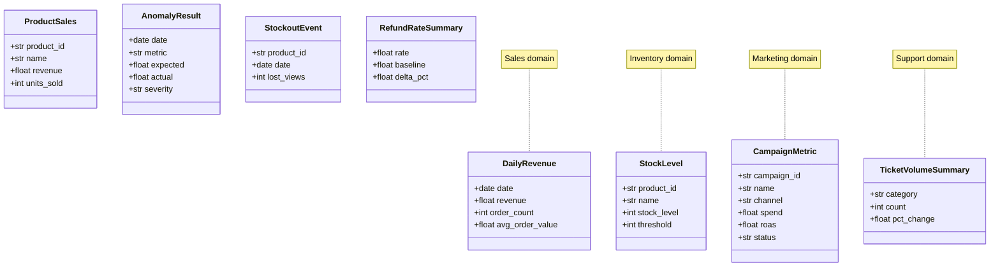
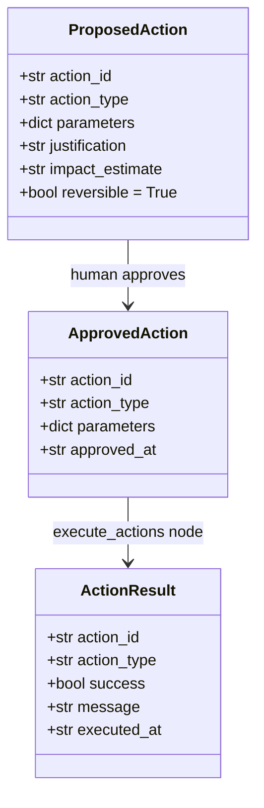
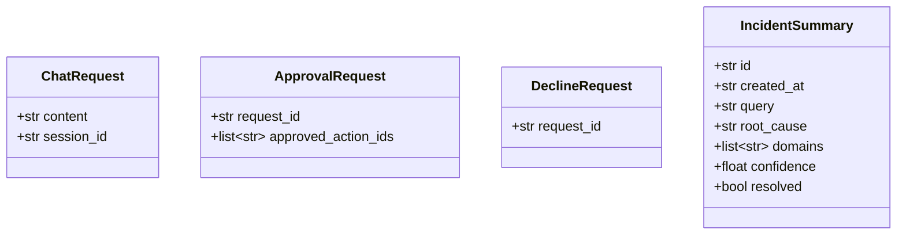
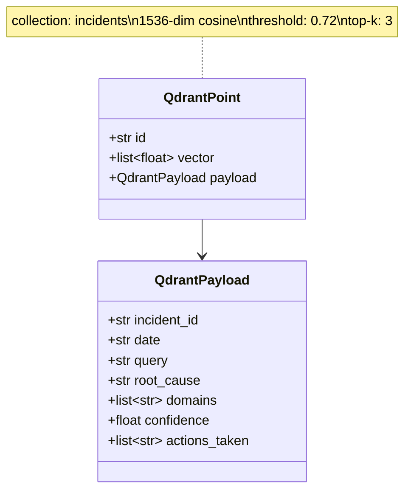
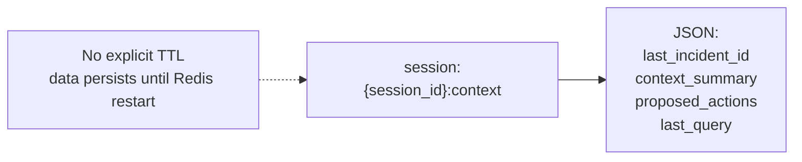

# Data Model

## PostgreSQL Entity-Relationship Diagram

```mermaid
erDiagram
    incidents {
        varchar36 id PK
        timestamptz created_at
        text query
        text root_cause
        text_array domains
        float confidence
        varchar128 embedding_id
        boolean resolved
    }

    incident_actions {
        uuid id PK
        varchar36 incident_id FK
        varchar64 action_type
        text parameters
        boolean approved
        timestamptz executed_at
        text outcome
    }

    daily_sales {
        date date PK
        numeric revenue
        int order_count
        numeric avg_order_value
    }

    products {
        varchar32 id PK
        text name
        text category
        numeric price
    }

    inventory {
        varchar32 product_id FK
        date date
        int stock_level
        int reorder_point
        PRIMARY KEY product_id_date
    }

    campaigns {
        varchar32 id PK
        text name
        varchar32 channel
        varchar16 status
        numeric daily_budget
    }

    support_tickets {
        uuid id PK
        timestamptz created_at
        varchar64 category
        varchar16 sentiment
        boolean resolved
    }

    product_daily_sales {
        varchar32 product_id FK
        date date
        int units_sold
        numeric revenue
        PRIMARY KEY product_id_date
    }

    regional_sales {
        varchar64 region
        date date
        numeric revenue
        int order_count
        PRIMARY KEY region_date
    }

    campaign_daily_metrics {
        varchar32 campaign_id FK
        date date
        numeric spend
        int impressions
        int clicks
        int conversions
        numeric revenue
        PRIMARY KEY campaign_id_date
    }

    channel_daily_performance {
        varchar32 channel
        date date
        numeric spend
        numeric revenue
        PRIMARY KEY channel_date
    }

    promotions {
        varchar32 id PK
        text name
        numeric discount_pct
        text_array products
        varchar16 status
        timestamptz scheduled_at
    }

    product_views {
        varchar32 product_id FK
        date date
        int views
        PRIMARY KEY product_id_date
    }

    incidents ||--o{ incident_actions : "has"
    products ||--o{ inventory : "tracks"
    products ||--o{ product_daily_sales : "has"
    products ||--o{ product_views : "tracks"
    campaigns ||--o{ campaign_daily_metrics : "has"
```

---

## Domain Model Class Diagram



---

## Action Model Class Diagram



### Supported `action_type` values

| `action_type` | Required parameters |
|---|---|
| `restock_product` | `product_id`, `quantity` |
| `apply_discount` | `product_id`, `discount_pct` |
| `pause_campaign` | `campaign_id` |
| `resume_campaign` | `campaign_id` |
| `create_support_ticket` | `category`, `description` |

---

## API Request/Response Models



---

## Qdrant Collection Schema



---

## Redis Key Structure


