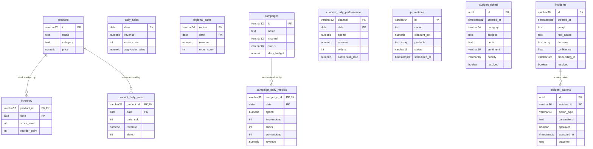
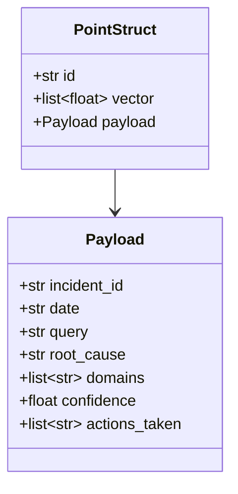
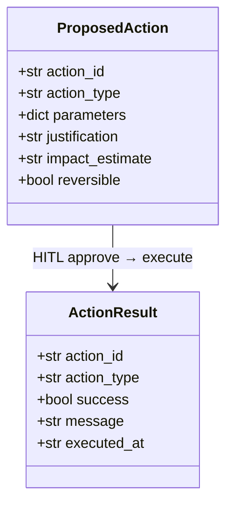

# Database — Ecomm Ops Brain

## PostgreSQL — Entity Relationship Diagram



---

## Table Descriptions

### Operational — Sales

**`daily_sales`** — Aggregate revenue metrics per day. Source of truth for `get_daily_revenue()` and anomaly detection (z-score over 30-day window).

**`product_daily_sales`** — Per-product revenue, unit sales, and view counts by day. Powers `get_product_sales_breakdown()` and conversion rate analysis.

**`regional_sales`** — Revenue and order count by region per day. Powers `get_regional_sales()` and regional anomaly detection.

### Operational — Inventory

**`inventory`** — Stock level and reorder point per product per day. `days_of_stock` is computed at query time as `stock_level / avg_daily_sales`. Status is derived: `out_of_stock` if 0, `low` if below `reorder_point`, else `ok`.

### Operational — Marketing

**`campaigns`** — Campaign master data. `status` is `active` or `paused`; action tools update this directly.

**`campaign_daily_metrics`** — Daily spend, impressions, clicks, conversions, and revenue per campaign. ROAS computed at query time as `revenue / spend`.

**`channel_daily_performance`** — Aggregated by channel (paid_search, email, organic, social) per day.

**`promotions`** — Discount promotions. Action tool `apply_discount` inserts rows here. `products` is a `TEXT[]` array of product IDs the promo applies to.

### Operational — Support

**`support_tickets`** — Individual support tickets. `category` (e.g. `stockout`, `shipping`, `refund`) and `sentiment` (`positive`, `neutral`, `negative`) are used to compute complaint theme counts. Complaint themes are derived by GROUP BY on `category`.

### System

**`incidents`** — One row per completed DIAGNOSTIC/ACTION/HYBRID/MEMORY query turn. Written by `_persist_incident_to_postgres()` after every successful `store_incident`. Qdrant is the source of truth for semantic retrieval; Postgres provides queryable history via `GET /incidents`.

**`incident_actions`** — One row per executed action, linked to its parent incident. `parameters` stored as JSON string. Written by action tools after execution.

**`checkpoint_*`** — LangGraph `AsyncPostgresSaver` tables (`checkpoint_blobs`, `checkpoint_migrations`, `checkpoint_writes`). Managed entirely by `langgraph-checkpoint-postgres`. Full `OpsState` is serialized here after every graph node. HITL `interrupt()` state is persisted here and restored on `Command(resume=...)`.

---

## Qdrant — incidents Collection



| Property | Value |
|---|---|
| Collection name | `incidents` (configurable via `QDRANT_COLLECTION`) |
| Vector size | 1536 dimensions |
| Distance metric | Cosine |
| Embedding model | Azure OpenAI `text-embedding-3-small-1` |
| Retrieval threshold | `score_threshold = 0.5` |
| Retrieval limit | `top_k = 3` |

**Vector text construction:**
```
{user_query} | root_cause: {root_cause[:400]} | sales_findings: {json[:200]} | inventory_findings: {json[:200]} | ...
```

All four domain findings are included if present. A richer, domain-specific query string will embed closer to stored incident vectors than a short generic one.

---

## Action Model



| `action_type` | Required parameters | DB operation |
|---|---|---|
| `restock_product` | `product_id`, `quantity` | INSERT/UPDATE inventory stock_level |
| `apply_discount` | `product_id`, `discount_pct` | INSERT INTO promotions |
| `pause_campaign` | `campaign_id` | UPDATE campaigns SET status='paused' |
| `resume_campaign` | `campaign_id` | UPDATE campaigns SET status='active' |
| `create_support_ticket` | `issue_type`, `description` | INSERT INTO support_tickets |

---

## Migrations

Migration files live in `backend/app/db/migrations/` and run automatically at backend startup via `_parse_sql_file()`. Applied in filename order.

| Migration | Contents |
|---|---|
| `001_initial_schema.sql` | `incidents`, `incident_actions`, `daily_sales`, `products`, `inventory`, `campaigns`, `support_tickets` |
| `002_seed_data.sql` | Seed data — products, inventory levels, campaigns, support tickets (idempotent, `ON CONFLICT DO NOTHING`) |
| `003_extend_schema.sql` | `product_daily_sales`, `regional_sales`, `campaign_daily_metrics`, `channel_daily_performance`, `promotions`, `product_views` |
| `004_varied_seed_data.sql` | 30-day varied seed data for `daily_sales`, `product_daily_sales`, `regional_sales` — realistic weekly patterns for dev/testing |

Seed data (mock products, inventory levels, sales history, campaigns, support tickets) is inserted in the same migrations for development use.
