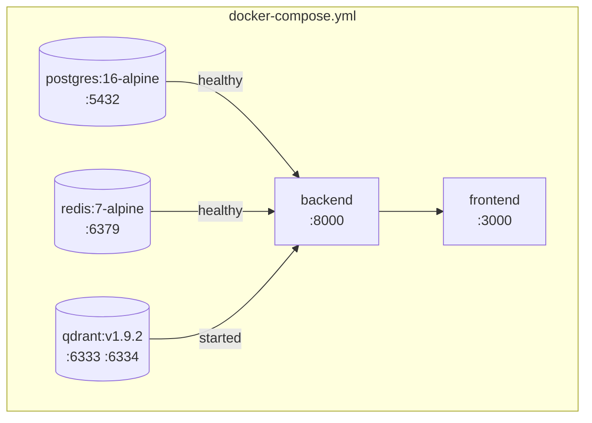
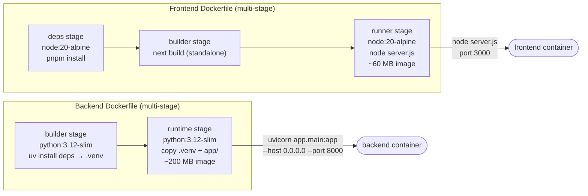
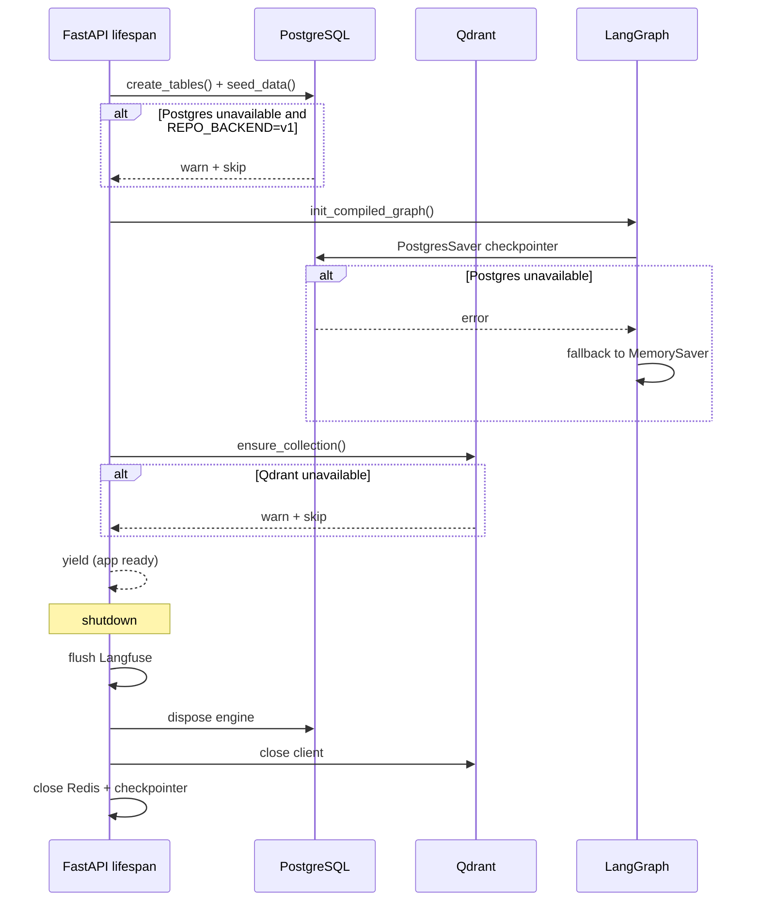
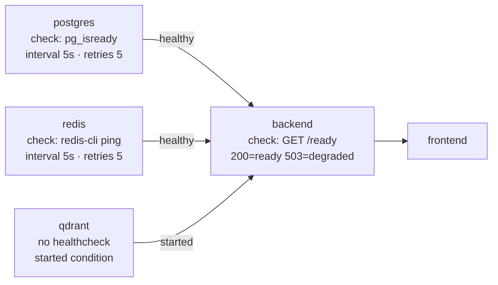
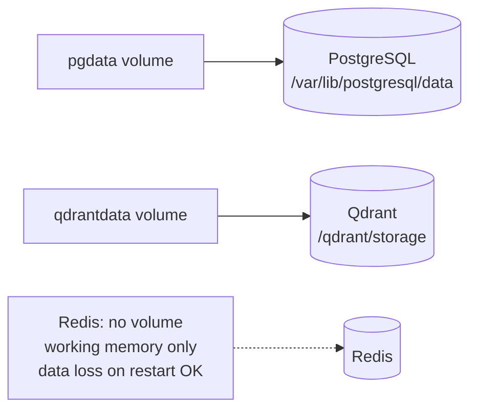
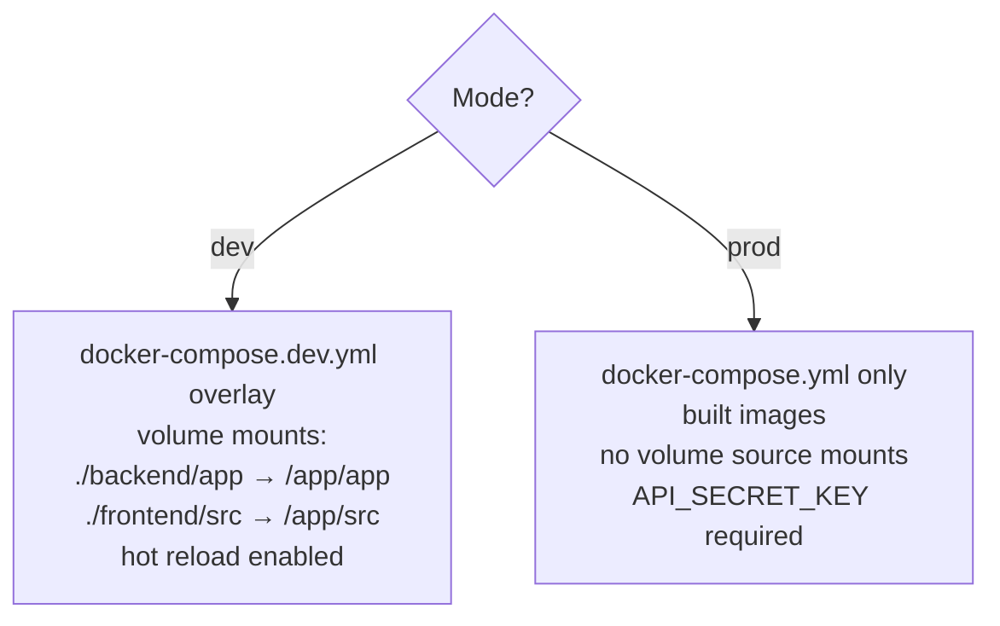

# Deployment

## Docker Compose Service Graph

---

## Docker Build Pipelines

---

## Backend Startup Sequence

---

## Service Dependencies & Healthchecks

---

## Volume Persistence

---

## Dev vs Production Mode

Commands:

| Goal | Command |
|---|---|
| Dev (hot reload) | `docker compose -f docker-compose.yml -f docker-compose.dev.yml up` |
| Prod (detached) | `docker compose up --build -d` |
| Stop | `docker compose down` |
| Wipe volumes | `docker compose down -v` |

