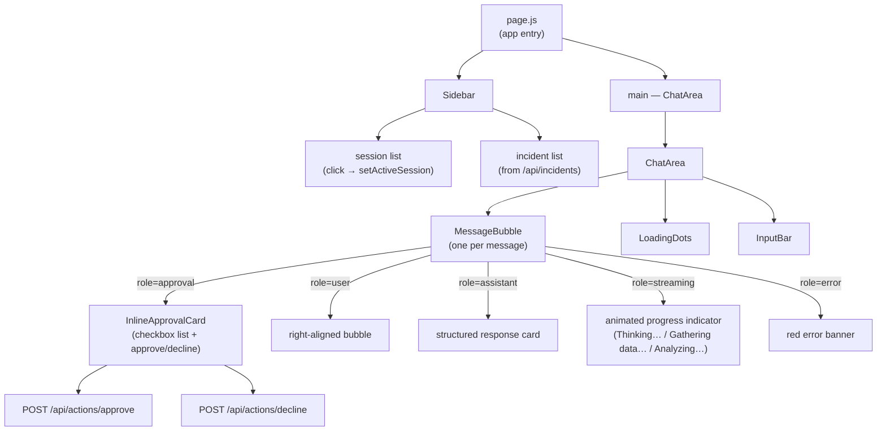
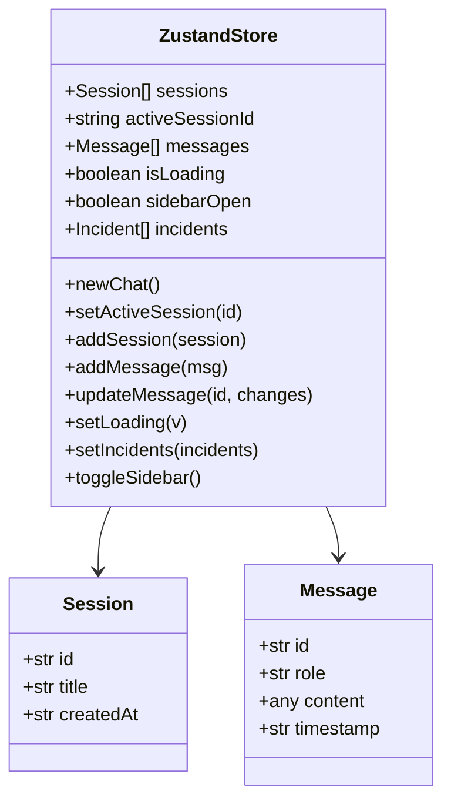
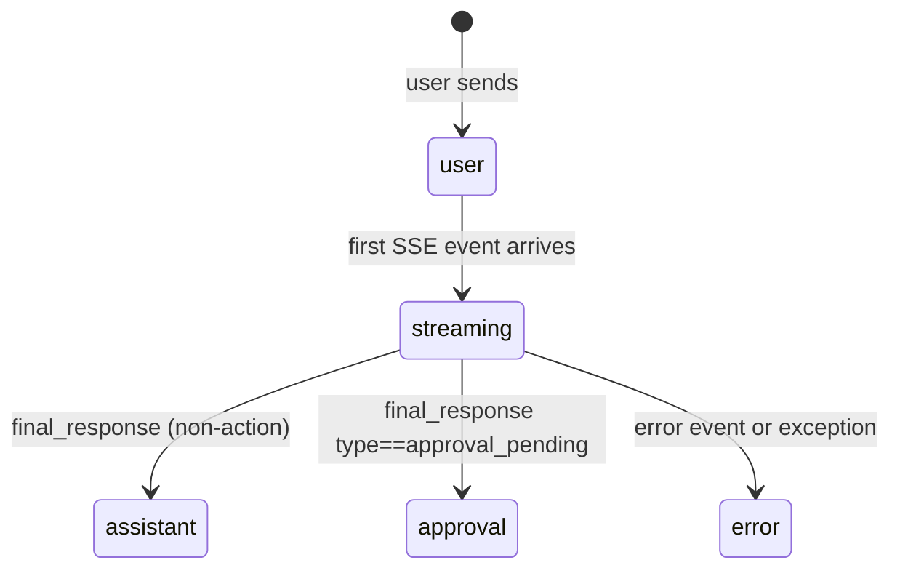
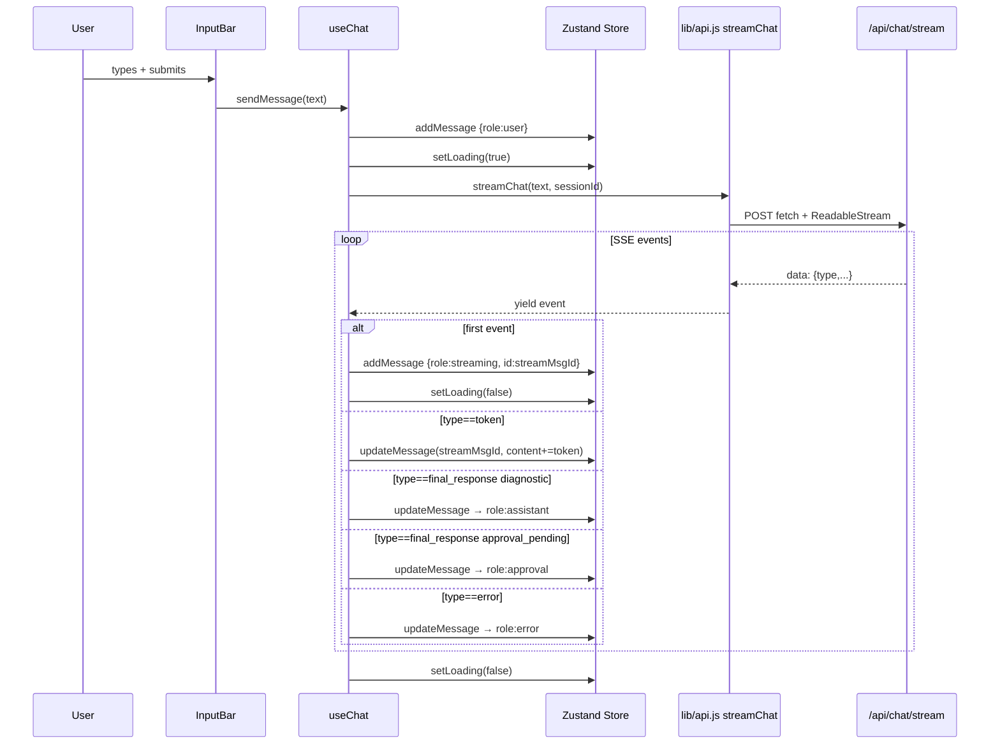
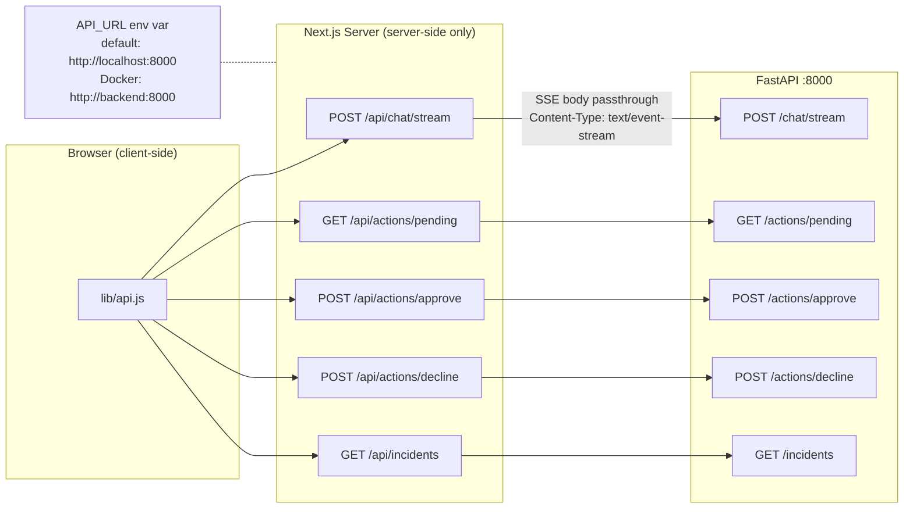

# Frontend Architecture

## Component Tree



---

## Zustand Store



### Message roles



> **Streaming bubble**: while in `streaming` state the bubble shows an animated stage label
> (`Thinking…` / `Gathering data…` / `Analyzing findings…` / `Synthesizing…` / `Preparing response…`)
> derived from the word-count of buffered tokens — raw tokens are not displayed.

---

## Chat Send Flow (useChat hook)



---

## API Proxy Layer



---

## File Structure

```
frontend/src/
├── app/
│   ├── page.js              entry — Sidebar + ChatArea
│   ├── layout.js            HTML shell
│   ├── globals.css          Tailwind base
│   └── api/
│       ├── chat/stream/route.js      SSE proxy
│       ├── actions/pending/route.js
│       ├── actions/approve/route.js
│       ├── actions/decline/route.js
│       └── incidents/route.js
├── components/
│   ├── Sidebar.jsx
│   ├── ChatArea.jsx
│   ├── MessageBubble.jsx
│   ├── ApprovalPanel.jsx
│   ├── InputBar.jsx
│   └── LoadingDots.jsx
├── hooks/
│   └── useChat.js
└── lib/
    ├── api.js               fetch wrappers + SSE async generator
    └── store.js             Zustand store
```
