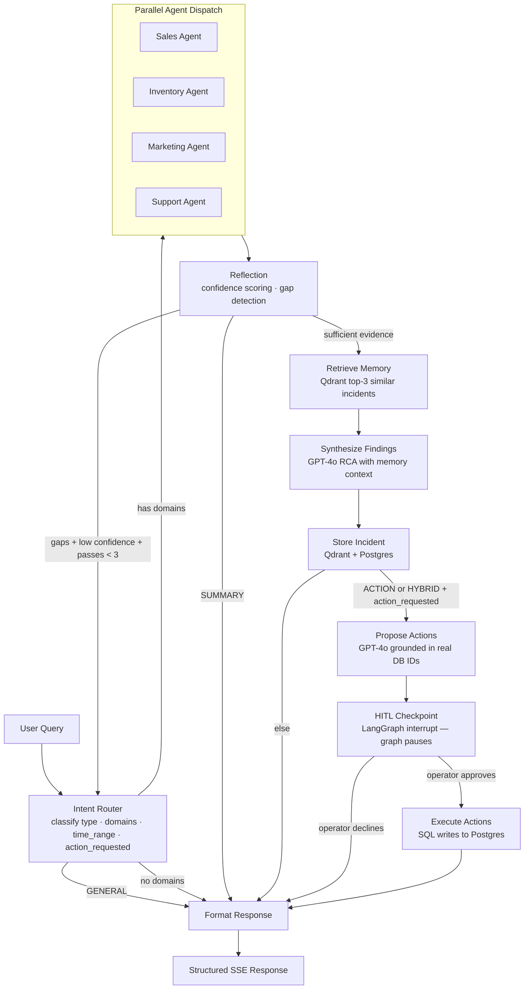

# High-Level Design — Ecomm Ops Brain

## 1. Purpose

Ecomm Ops Brain is a conversational AI assistant for e-commerce operations teams. It answers questions about sales, inventory, marketing, and support; diagnoses business issues; proposes corrective actions grounded in real data; and executes approved actions with a human-in-the-loop checkpoint.

---

## 2. Core Capabilities

| Capability | Description |
|---|---|
| Multi-domain diagnosis | Runs 4 specialist agents in parallel; reflection loop scores confidence and re-queries missing domains (up to 3 passes) |
| Root cause synthesis | GPT-4o synthesizes cross-domain findings with conversation history and past incident context |
| Episodic memory | Embeds and stores every incident in Qdrant; retrieves semantically similar past incidents to inform synthesis |
| Human-in-the-loop actions | Proposes parameterized corrective actions; pauses for operator approval before executing any write |
| Conversational continuity | Full conversation history persisted via LangGraph checkpointer; no external session store required |

---

## 3. Query Types and Graph Routing

| `query_type` | What it means | Graph path |
|---|---|---|
| `DIAGNOSTIC` | Root cause analysis | agents → reflect → memory → synthesize → store → format |
| `SUMMARY` | Periodic report / overview | agents → reflect → **format** (skips synthesis) |
| `ACTION` | Execute a specific change | agents → reflect → memory → synthesize → store → propose → HITL → execute → format |
| `HYBRID` | Diagnose + fix in one request | same as ACTION when `action_requested=true`; else same as DIAGNOSTIC |
| `MEMORY` | Recall past incidents | agents → reflect → memory → synthesize → store → format |
| `GENERAL` | Conversational / off-topic | **format_response directly** (no agents invoked) |

`action_requested` is a boolean on the `Intent` object. A `HYBRID` query only routes to action proposal when this flag is `true` — preventing diagnostic queries from incorrectly triggering HITL.

---

## 4. High-Level Flow



---

## 5. Human-in-the-Loop Design

HITL uses LangGraph's `interrupt()` primitive — no external workflow engine:

1. `node_hitl_checkpoint` calls `interrupt({"proposed_actions": [...]})` — full `OpsState` is serialized to the PostgreSQL checkpointer and graph execution pauses
2. The SSE stream ends with a `final_response` event where `response.type = "approval_pending"`, containing the proposed actions and `workflow_id = session_id`
3. Frontend renders an `InlineApprovalCard`; operator selects which actions to approve
4. Frontend calls `POST /api/actions/approve` or `/decline` with selected `action_id`s
5. Backend calls `graph.ainvoke(Command(resume={...}), config)` to resume from the checkpointer snapshot
6. `execute_actions` runs only the approved actions; declined actions are dropped

No write operations execute without explicit operator approval.

---

## 6. Memory Architecture

| Tier | Storage | Purpose |
|---|---|---|
| Conversational | PostgreSQL (`checkpoint_*` tables via `AsyncPostgresSaver`) | Conversation history per session; loaded automatically by LangGraph on each turn |
| Episodic | Qdrant `incidents` collection | Semantic similarity search for past incidents; top-3 injected into synthesis prompt |
| Structured | PostgreSQL `incidents` + `incident_actions` | Queryable incident log; secondary mirror of Qdrant payload |

Every completed DIAGNOSTIC/ACTION/HYBRID/MEMORY turn writes an incident to Qdrant (via `store_incident` node which always runs after `synthesize_findings`). SUMMARY and GENERAL queries do not generate incidents.

---

## 7. Data Stores

| Store | Contents | Access |
|---|---|---|
| PostgreSQL | Operational data (sales, inventory, campaigns, tickets, promotions), incident log, LangGraph checkpoint state | Read by agent tools; write by action tools and checkpointer |
| Qdrant | Incident vectors (1536-dim cosine) in `incidents` collection | Write at `store_incident`; read at `retrieve_memory` |

---

## 8. Deployment Topology

```
┌─────────────────────────────────────────────┐
│  Docker Compose                              │
│                                             │
│  frontend  :3000  ──▶  backend  :8000       │
│                            │                │
│                   ┌────────┴────────┐       │
│                   ▼                 ▼       │
│             postgres :5432     qdrant :6333 │
└─────────────────────────────────────────────┘
```

All services run in Docker Compose. The backend is the only service that connects to PostgreSQL and Qdrant. The frontend only connects to the backend.
