# System Internals — Ecomm Ops Brain

Visual deep-dive into every runtime layer. Each section is a standalone diagram for demo use.

---

## 1. Request Lifecycle — Browser to Response

Every user message passes through five distinct runtime layers before the response is streamed back.

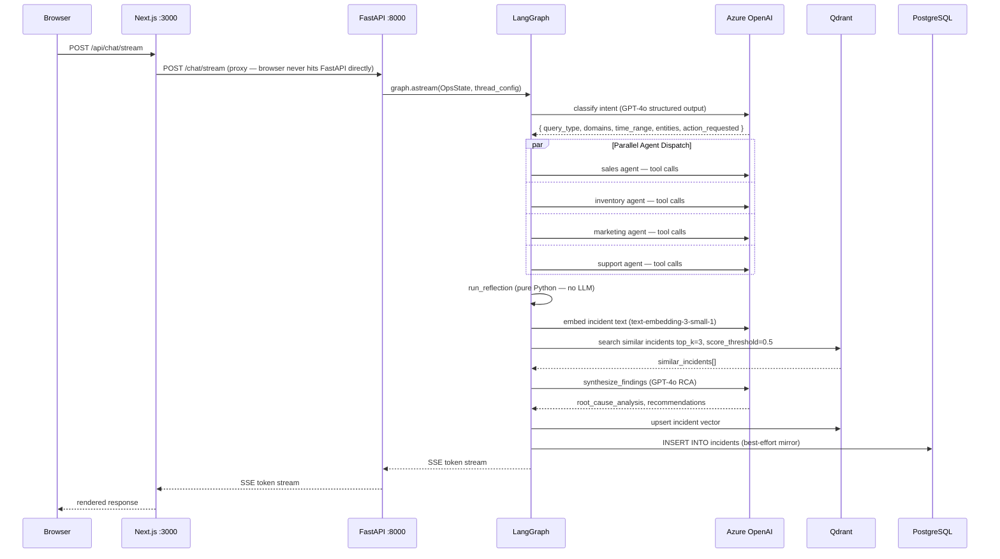

---

## 2. Complete LangGraph Workflow

All 13 nodes and every conditional edge in one view.

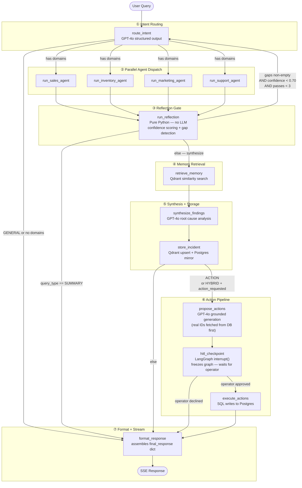

---

## 3. Intent Classification — What the Router Produces

The intent router makes a single GPT-4o structured output call. Everything downstream depends on the result.

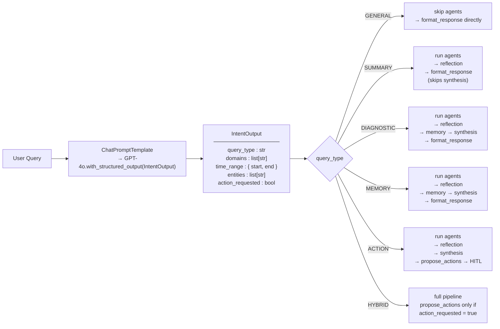

---

## 4. Parallel Agent Dispatch — Fan-Out / Fan-In

`edge_dispatch_agents` returns a list of node names — LangGraph executes all of them concurrently in the same graph step.

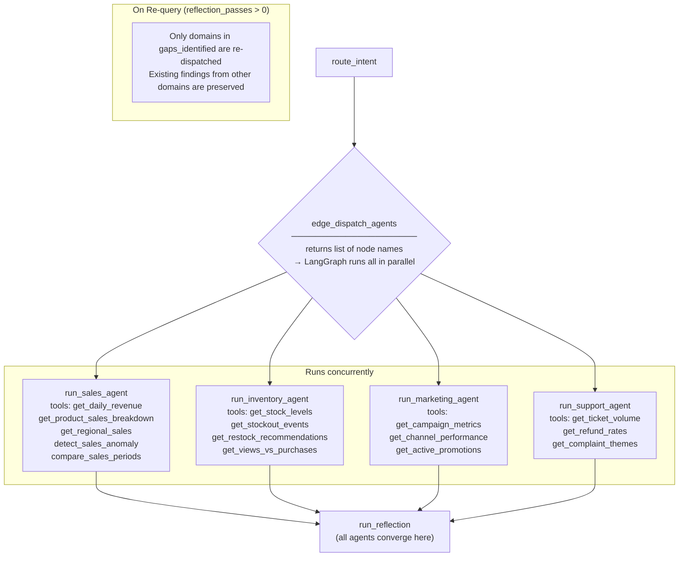

---

## 5. Reflection Confidence Gate

The only node with zero LLM calls. Runs after every agent dispatch.

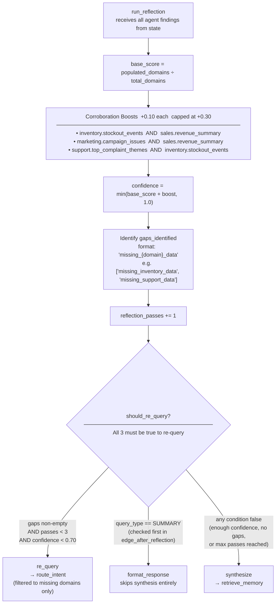

---

## 6. Memory Layer — Store and Retrieve

Both operations use the same `_build_incident_text()` function so query and storage vectors are in the same semantic space.

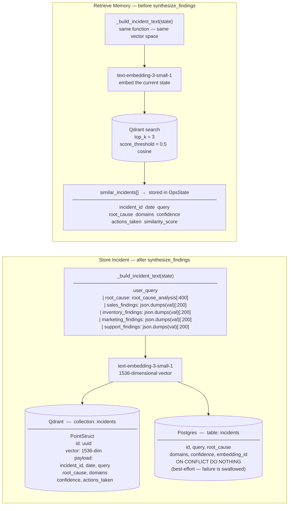

---

## 7. Human-in-the-Loop — Suspend, Approve, Resume

LangGraph `interrupt()` freezes the graph. `AsyncPostgresSaver` persists the frozen state so it survives server restarts and arbitrary operator delays.

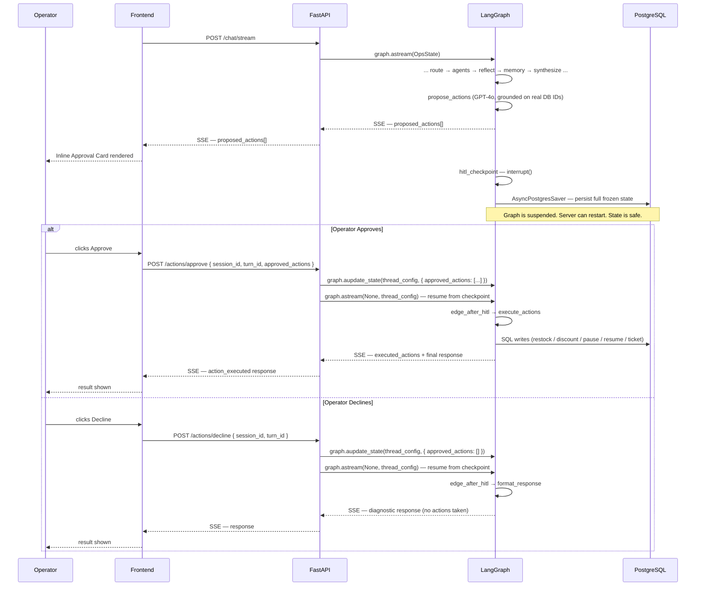

---

## 8. Action Execution Pipeline

Each approved action maps to a specific SQL operation. Actions are executed independently — one failure does not abort the rest.

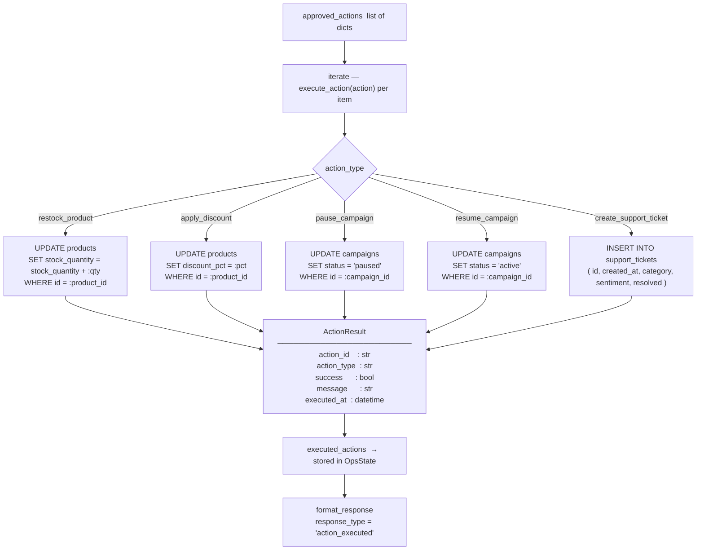

---

## 9. OpsState — Full Field Map

Every field in the shared state, grouped by the node that writes it.

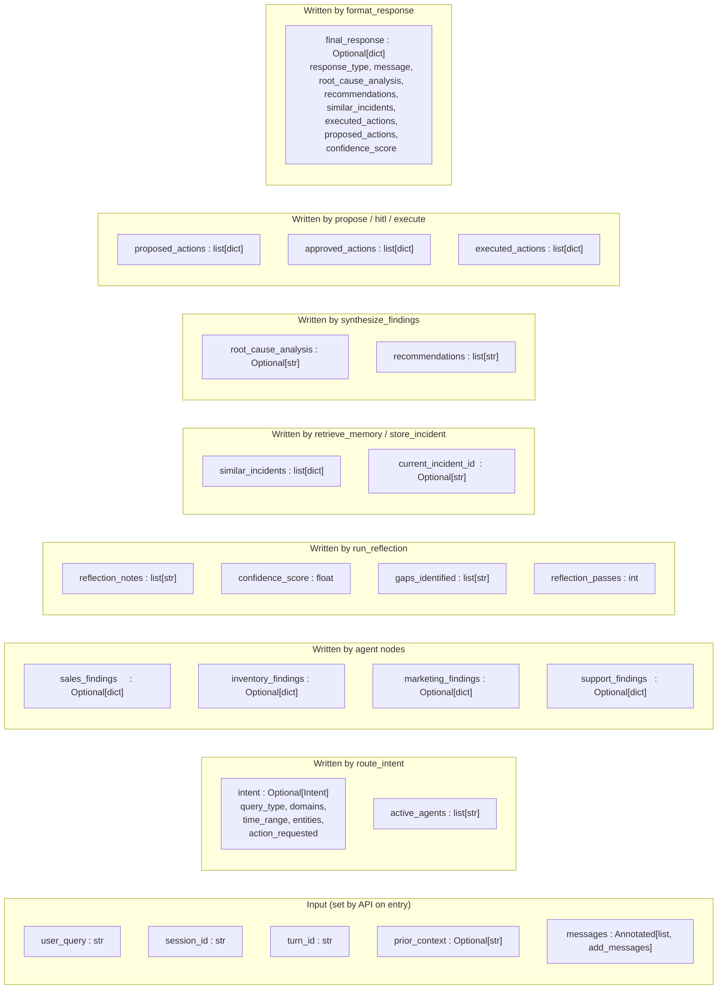

---

## 10. Response Types — What format_response Emits

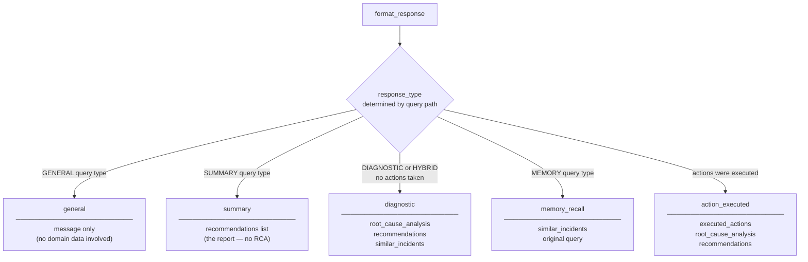

---

## 11. Startup and Dependency Order

```mermaid
flowchart TD

    subgraph COMPOSE ["Docker Compose — depends_on chain"]
        PG_SVC["postgres\nhealthcheck: pg_isready -U postgres"]
        QD_SVC["qdrant\ncondition: service_started"]
        BE_SVC["backend\nhealthcheck: GET /health"]
        FE_SVC["frontend\n(no healthcheck)"]

        PG_SVC -->|"condition: service_healthy"| BE_SVC
        QD_SVC -->|"condition: service_started"| BE_SVC
        BE_SVC -->|"condition: service_healthy"| FE_SVC
    end

    subgraph LIFESPAN ["Backend lifespan()  —  runs once at startup"]
        L1["create_tables()\nDDL for all tables  idempotent"]
        L2["seed_data()\ninsert fixture rows if tables are empty"]
        L3["init_checkpointer(postgres_url_plain)\nAsyncPostgresSaver\n↳ fallback: MemorySaver if Postgres down"]
        L4["init_compiled_graph(checkpointer)\nbuild_graph().compile(checkpointer=...)"]
        L5["ensure_collection()\nQdrant  'incidents'  collection\n↳ skipped gracefully if Qdrant down"]
        L6(["App Ready\nGET /health returns 200"])

        L1 --> L2 --> L3 --> L4 --> L5 --> L6
    end
```

---

## 12. Observability — Langfuse Tracing

Tracing is opt-in. If `LANGFUSE_PUBLIC_KEY` is empty, no callbacks are attached and there is zero overhead.

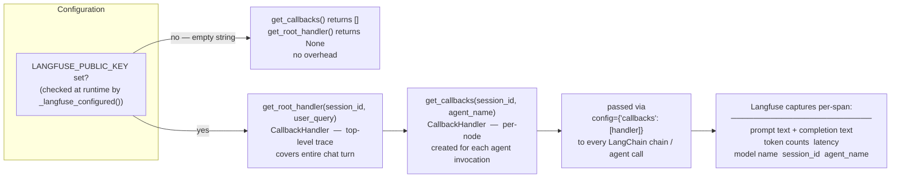
