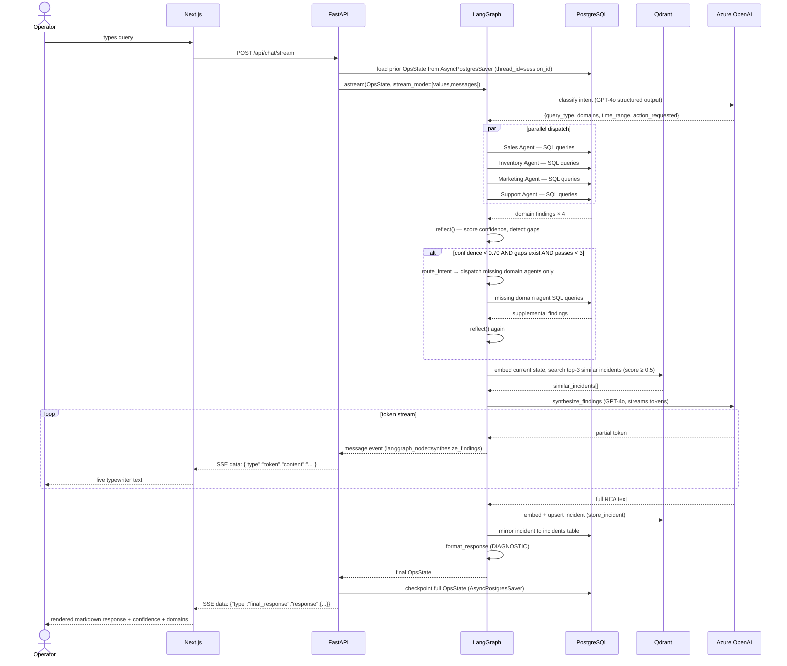
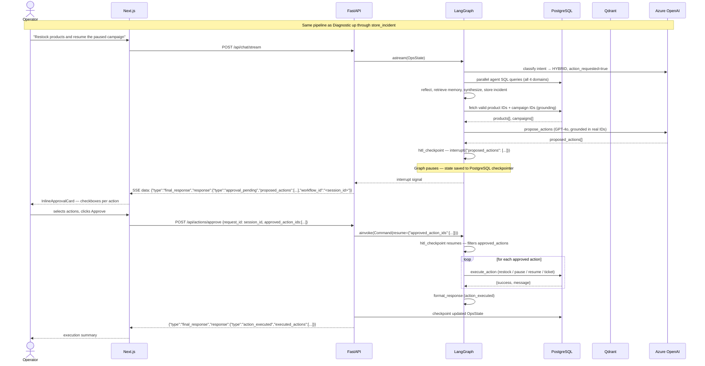
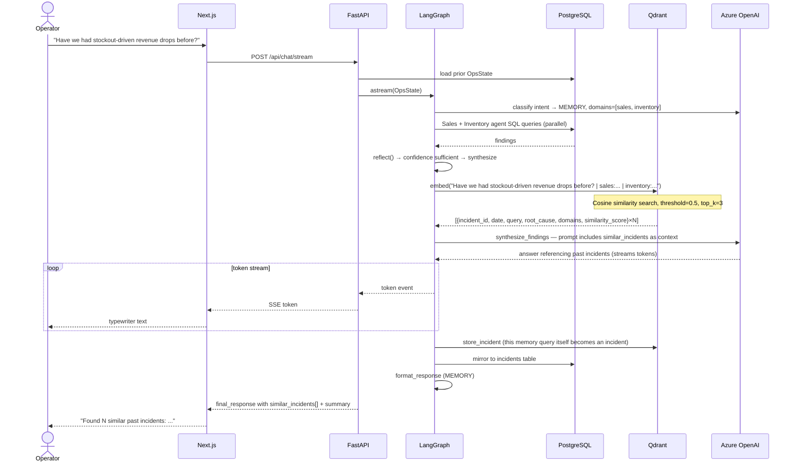
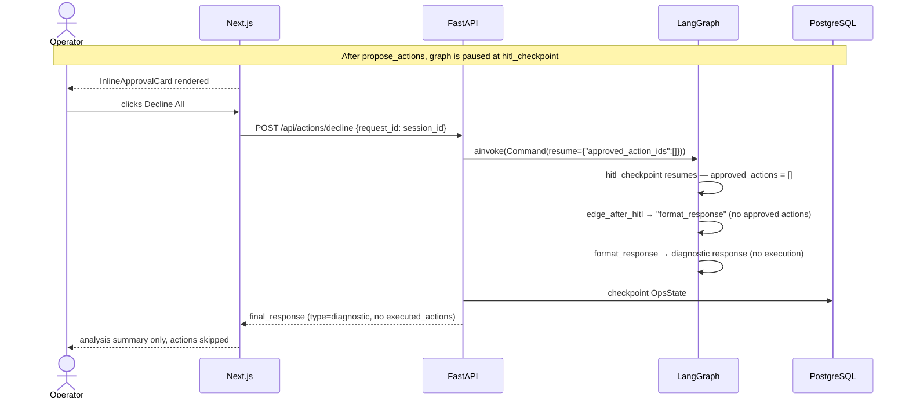
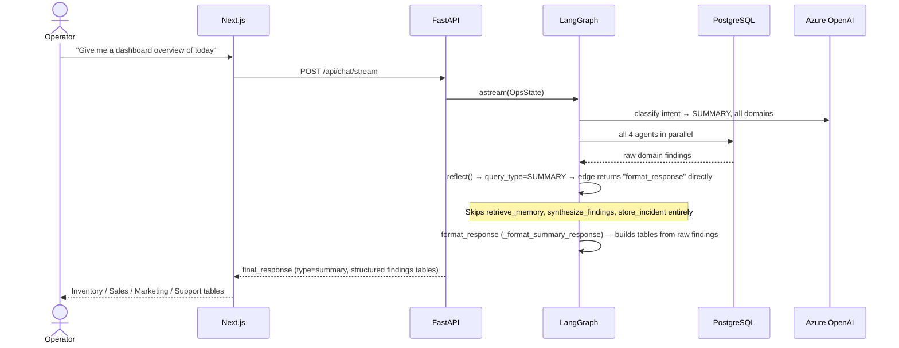

# Sequence Diagrams — Ecomm Ops Brain

## 1. Diagnostic Query (full pipeline)

---

## 2. Action / HITL Query

---

## 3. Memory Query

---

## 4. HITL Decline Flow

---

## 5. SUMMARY Query (short path)

Note: SUMMARY queries do **not** write to Qdrant (no `store_incident` call) and do not invoke the LLM for synthesis.
